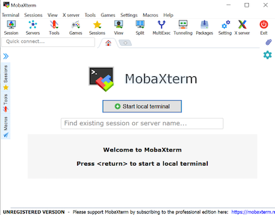

## Important Note

This lesson covers how to log into, and out of, the TU Delft cloud instance.

## Background to TU Delft environment

You will be using TU Delft cloud instances which contain all the software and data needed for this workshop. To be able to connect to the cloud instance from outside the TU Delft campus you first have to connect to a Linux bastion host. During this session you will learn how to do this.

## Connection Protocols

We will use a protocol called Secure Shell (SSH) that, as the name implies, provides you
with a secure way to use a [shell](http://swcarpentry.github.io/shell-novice). In our case,
the shell will be running on a remote machine. This protocol is available for every
operating system, but sometimes requires additional software.

## Logging onto the TU Delft Linux environment

**Please select the platform you wish to use for the exercises: <select id="id_platform" name="platformlist" onchange="change_content_by_platform('id_platform');return false;"><option value="aws_unix" id="id_aws_unix" selected> AWS_UNIX </option><option value="aws_win" id="id_aws_win" selected> AWS_Windows </option></select>**

#### Connecting using PC

*Prerequisites*: You must have an SSH client. There are several free options but you should have installed [MobaXterm](https://mobaxterm.mobatek.net/download-home-edition.html) at the begining of the workshop, and we're going to continue using that.

1. Open MobaXterm

2. Click "Start local terminal” in the middle of the MobaXterm screen

    

3. To connect to the TU Delft Linux gateway (student-linux.tudelft.nl) Type the following command:

    

    *Be sure to pay attention to capitalization and spaces*

4. You will receive a security message that looks something like the message below

    ~~~
    The authenticity of host 'student-linux.tudelft.nl (131.180.123.205)' can't be established.
    ECDSA key fingerprint is 1c:24:7c:8b:3c:f9:34:d5:25:02:8a:a6:1b:11:ea:5a.
    Are you sure you want to continue connecting (yes/no)?
    ~~~
    {: .bash}

5. Type `yes` to proceed

6. In the final step, you will be asked to provide a login and password
    
    **Note:** When typing your password, it is common in Unix/Linux not see any asterisks (e.g. `****`) or moving cursors. Just continue typing.

You should now be connected!

#### Connecting using Mac/Linux

Mac and Linux operating systems will already have terminals installed. 

1. Open the terminal

    Simply search for 'Terminal' and/or look for the terminal icon

    

2. To connect to the TU Delft Linux gateway (student-linux.tudelft.nl) Type the following command:

    ~~~
    $ ssh REPLACE-WITH-YOUR-NETID@student-linux.tudelft.nl
    ~~~
    {: .bash}

    *Be sure to pay attention to capitalization and spaces*

3. You will receive a security message that looks something like the message below

    ~~~
    The authenticity of host 'student-linux.tudelft.nl (131.180.123.205)' can't be established.
    ECDSA key fingerprint is 1c:24:7c:8b:3c:f9:34:d5:25:02:8a:a6:1b:11:ea:5a.
    Are you sure you want to continue connecting (yes/no)?
    ~~~
    {: .bash}

4. Type `yes` to proceed
5. In the final step, you will be asked to provide a login and password
    
    **Note:** When typing your password, it is common in Unix/Linux not see any asterisks (e.g. `****`) or moving cursors. Just continue typing.

You should now be connected!

## Logging onto the TU Delft cloud instance

1.  Connect to one of the TU Delft cloud instances. Your instructeur will assign one which you will use during the course.

    ~~~
    $ ssh REPLACE-WITH-YOUR-NETID@vm0X-bt-edu.tnw.tudelft.nl
    ~~~
    {: .bash}

2.  You will receive a security message that looks something like the message below

    ~~~
    The authenticity of host 'vm03-bt-edu.tnw.tudelft.nl (131.180.205.58)' can't be established.
    ECDSA key fingerprint is 1c:24:7c:8b:3c:f9:34:d5:25:02:8a:a6:1b:11:ea:5a.
    Are you sure you want to continue connecting (yes/no)?
    ~~~
    {: .bash}

3. Type `yes` to proceed

4. In the final step, you will be asked to provide a login and password
    
    **Note:** When typing your password, it is common in Unix/Linux not see any asterisks (e.g. `****`) or moving cursors. Just continue typing.

You should now be connected!

## Logging off a cloud instance

Logging off your instance is a lot like logging out of your local computer: it stops any processes
that are currently running, but doesn't shut the computer off.

To log off, use the `exit` command in the same terminal you connected with. This will close the connection to the cloud instance, and your terminal will go back to showing the student-linux bastion host:

~~~
YOUR-NETID@vm03-bt-edu:~$ exit
logout
Connection to vm03-bt-edu.tnw.tudelft.nl closed.
-bash-4.1$
~~~
{: .bash}

To log off the student-linux bastion, type `exit` again. This will close the connection to the student-linux bastion, and your terminal will go back to showing your local computer.:

~~~
-bash-4.1$ exit
logout
Connection to linux-bastion.tudelft.nl closed.
Amandas-MacBook-Pro-3 $
~~~
{: .bash}

## Logging back in

Internet connections can be slow or unstable. If you're just browsing the internet, that means you have
reload pages, or wait for pictures to load. When you're working in cloud, that means you'll sometimes
be suddenly disconnected from your instance when you weren't expecting it. Even on the best internet
connections, your signal will occasionally drop, so it's good to know the above SSH steps, and be able
to log into the cloud environment without looking up the instructions each time.

In the next section, we'll also show you some programs that you can use to keep your processes going
even if your connection drops. But for now, just practice logging on and off a few times.
